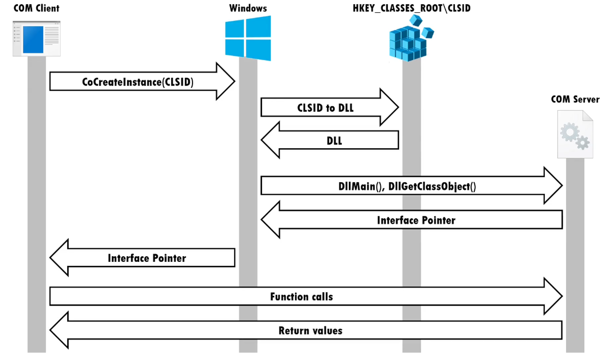
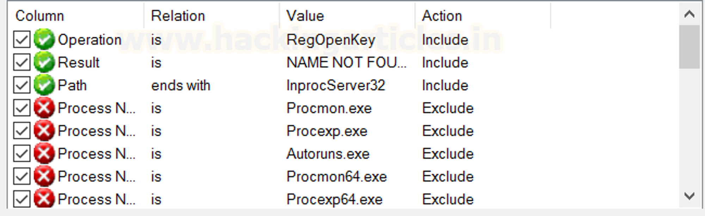
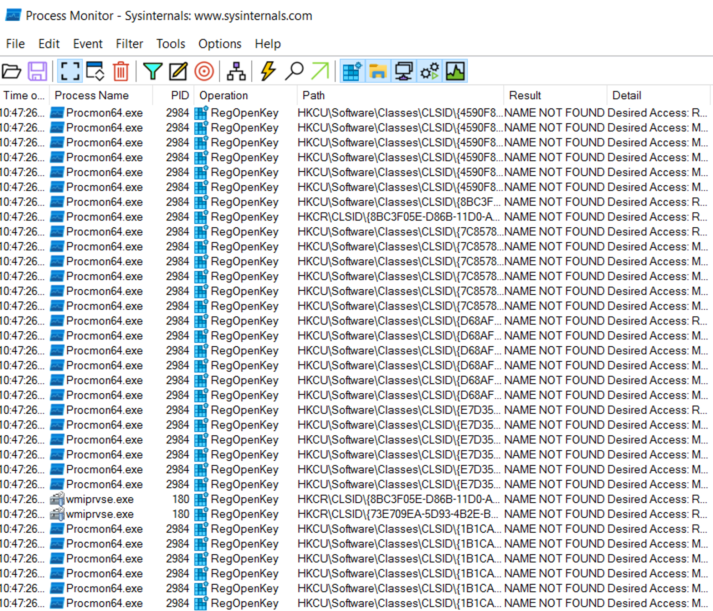
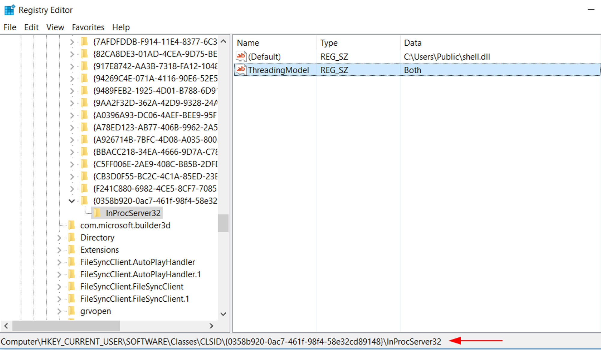
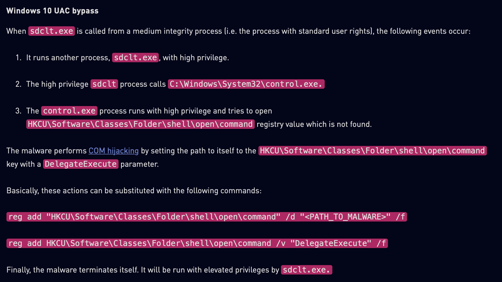
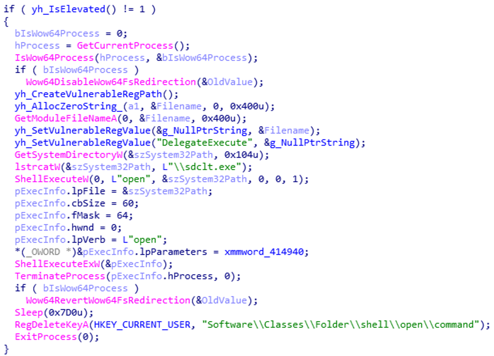

# 1. Introduction

## What is a COM Object?
A COM object is an `instance` of an `object definition`, which specifies the object's data and one or more implementations of interfaces on the object. 

`Clients interact with a COM object only through its interfaces.`

:::note
🗒️ It uses the Windows API `CoCreateInstance` to construct an uninitialized object instance of a specific class, with the `CLSID` as one of the needed parameters (*class identifier*).
When a program calls `CoCreateInstance` with a particular `CLSID` value, the operating system asks the registry to discover which binary contains the requested `COM` code.
:::

:::important[IUnknown interface Explained]
All COM interfaces inherit from the **IUnknown interface**. The *IUnknown interface* contains the fundamental COM operations and responsible for instance management. The IUnknown interface has **three member functions**, named `QueryInterface`, `AddRef`, and `Release`. All COM objects are required to implement the IUnknown interface.
:::

💡 To start stuffs we need to know the `IID` as well, passes it to `QueryInterface()` to obtain the interface pointer along with calling AddRef [`AddRef` is used to increment the reference count when a new client is acquiring the object] then once the COM object seems to be useless or not being used by the system it calls `Release` to decrements the reference count for an interface on a COM object.

If you don't know the CLSID of an object, use `CLSIDFromProgID()`

* A pointer to the ProgID whose CLSID is requested.
* Receives a pointer to the retrieved CLSID on return.

> If the ProgID cannot be found in the registry, **CLSIDFromProgID** creates an `OLE 1 CLSID for the ProgID and a CLSID entry in the registry.`

---
# 2. COM and Windows Registry
## COM Registry database

To locate a COM object, the registry is used. 
Windows Registry contains the mapping information for every COM object implementation on disk.

These are the locations of the registry keys from which you can extract the location of a COM Object:

- **`HKEY_CLASSES_ROOT\CLSID` :** Key for **64-bit** application.
- **`HKEY_CLASSES_ROOT\WOW6432Node\CLSID`** Key for **32-bit** application.

COM has two main types of identifiers to locate COM objects, **`CLSID`** and **`ProgID`.**

:::caution[Execution Explained]
When executing a COM Object, the windows service manager (SCM) attempts to locate the CLSID it received as an argument in the registry, once it locates the key with the CLSID it queries its keys in attempt to find the COM server(activated COM object). 
:::

Various registry sub-keys are used during COM Hijacking depending on how the malicious code is run. These are the following:

- `InprocServer/InprocServer32`**:** Path to a DLL Server
- `LocalServer/LocalServer32`**:** Path to an EXE Server
- `TreatAs`**:** Points another CLSID
- `ProgID`**:** A registry entry that can be associated with a `CLSID`. Like the `CLSID`, the `ProgID` identifies a class but with less precision because it is not guaranteed to be globally unique.

The sub-keys listed above are found in the following registry hives.

- `HKEY_CURRENT_USER\Software\Classes\CLSID` : Per-User object registration
- `HKEY_LOCAL_MACHINE\Software\Classes\CLSID` : System-wide registration

---

# 3. Discover Hijackable Keys

- **Operation is RegOpenKey Include**
- **Result is NAME NOT FOUND Include**
- **Path ends with InprocServer32/LocalServer32 Include**

:::caution[Hijackable keys]

:::

---

# 3. Mitigations

This type of attack technique cannot be easily mitigated with preventive controls since it is based on the abuse of system features.

### Usage of COM Hijacking

- `Persistence`
- `Lateral movement`
- `Privilege escalation`
- `Defense evasion`

---

# 4. CLSID Hijacking Explained

### Overview

- Modify the registry value `InprocServer32` which contains the location of the target COM Server.
- Map it to a malicious COM Object.

### Requirement

- A COM Object we compiled
- Create/Edit relevant registry Keys/Values of the COM Obejct that is going to be hijacked.

:::caution[Steps for the attack]

- 1. Choose Target COM Object
- Example: `random.Shell` CLSID: `{72C24DD5-D70A-438B-8A42-98424B88AFB8}`
- Locate target COM object in HKLM.
- Typically, no entry exists in HKCU, HKCU key will be created upon hijacking.
- Before a process can access a COM object, registration is needed first. Via `regsvr32.exe`, COM object can self-register.
- `regsvr32.exe /n <dllname>.dll` → Manual way of registering/unregistering COM DLLs, which uses **DllRegisterServer** and **DllUnregisterServer** function calls.
- **COMHijackToolkit**: Specialized for hijacking COM objects and automating the process.
- Execute the COM object using a ProgID
:::

# APT group: Warzone 

Reference: [Warzone - Checkpoint ](https://research.checkpoint.com/2020/warzone-behind-the-enemy-lines/)

- **1. Disable Wow64 File System Redirection**
    
    If the process is running under Wow64 (Windows-on-Windows 64-bit), it disables file system redirection to make sure that 32-bit processes can access the correct system directories.
    
- **2. Setting Up Malicious Registry Entries**
    - Create a vulnerable registry path and set a registry value to the malware's path.
    - Add a `DelegateExecute` parameter to the registry key to specify the executable to run.
    - Couldn’t find any information in msdn about `DelegateExecute`.
    
:::important
💡 `DelegateExecute:` the command handler is implemented as a `IExecuteCommand` COM object instead of a simple application that is executed.
:::
    
- **3. Getting System Directory and Execute `sdclt.exe`**
    - Retrieve the path to `C:\Windows\System32\`.
    - Append `sdclt.exe` to the path and execute it using `ShellExecuteW`.
- **4. Execute with Elevated Privileges**:
    - When `sdclt.exe` runs, it attempts to execute `control.exe` with high privileges.
    - `control.exe` checks the specified registry key but finds it hijacked to point to the malware.
    - As a result, `sdclt.exe` executes the malware with elevated privileges.
- **5. Remove itself**
    - Deletes the created registry keys.
    - Terminates the process to remove traces of the operation.